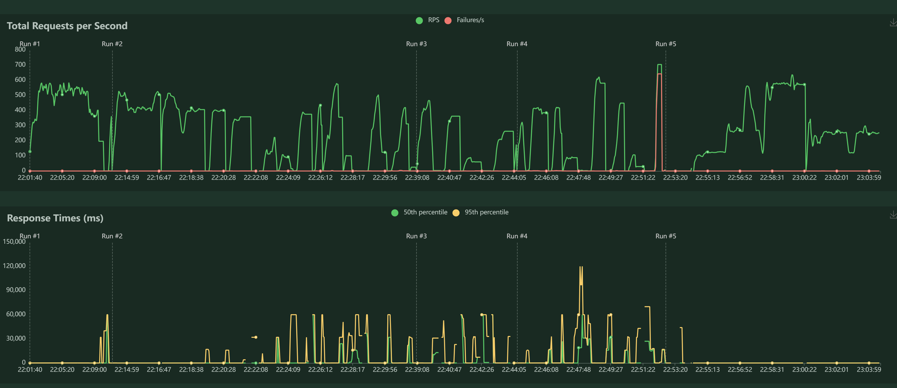
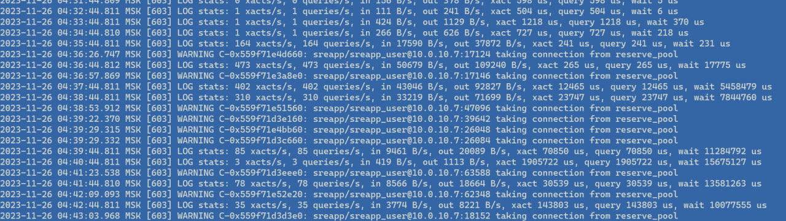
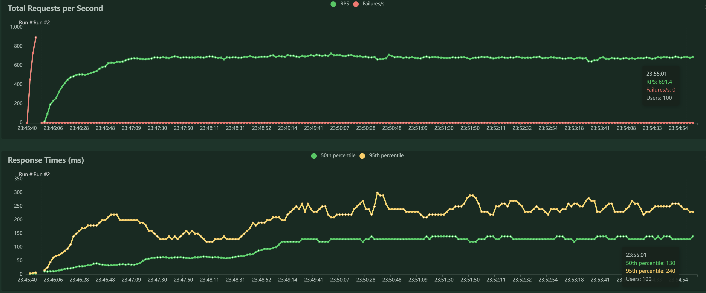
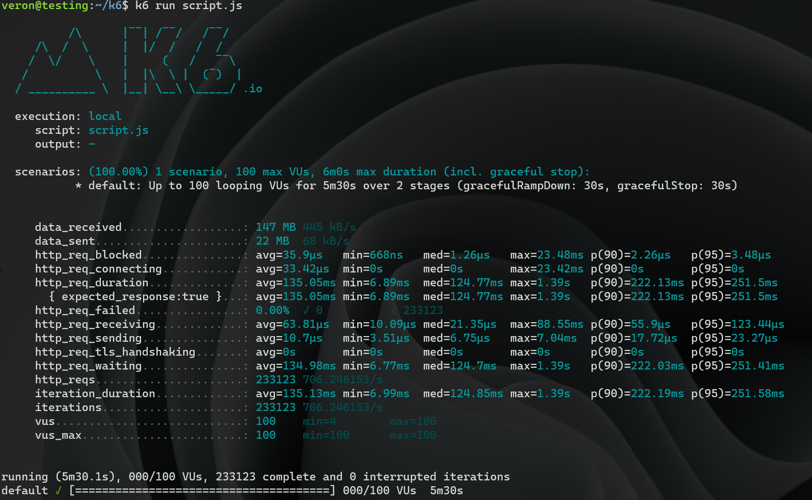
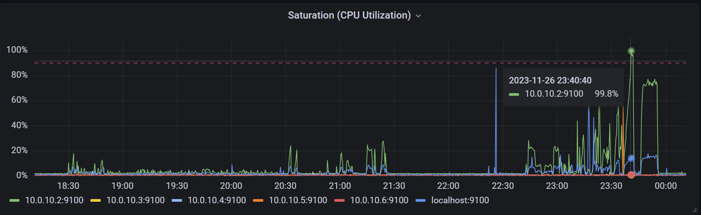

# Нагрузочное тестирование сервиса.
Тестирование производилось с использованием ПО locust и k6. 
Для исключения сторонних факторов, тесты запускались с отдельной виртуальной машины в том же ДЦ, что и основные сервера сервиса.
Простые скрипты тестирования находится [здесь](locustfile.py) и [здесь](script.js). Сценарий тестирования заключается в единственном получении ручки прогноза погоды для всех городов (/WeatherForecast) - как единственной подходящей для типичного использования обычным пользователем.

## Нефункциональные требования
SLO:
- latency = 300ms
- error_codes = [!=200]

## Тесты
При первоначальном тестировании получил странные результаты: 

Были пики по rps и тут же провалы с ошибками (таймауты).
Просмотрев логи сервисов, обнаружил проблемы с pgbouncer:

По умолчанию в pgbouncer есть настройка default_pool_size=20, которая определяет разрешенное количество соединений для каждой пары пользователь/база. Изменил данную настройку до 500 на обоих нодах, перезапустил pgbouncer.
Запустил locust снова:

Тестирование с использованием k6:

## Выводы
Тут хорошо виден потолок нашего сервиса в ~690 rps. 

95-ый персентиль составляет 251мс, что укладывается в наш SLO.
При этом загрузка ЦПУ ноды базы данных в этот момент тоже доходит до 90-100%:

зеленый график - график использования процессора сервером БД.
Отсюда делаем вывод, что в данный момент узким горлышком нашей системы является ЦПУ базы данных.